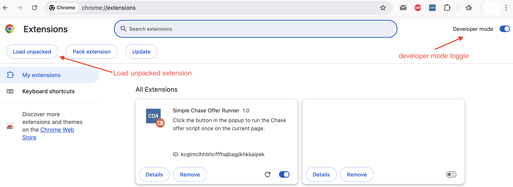
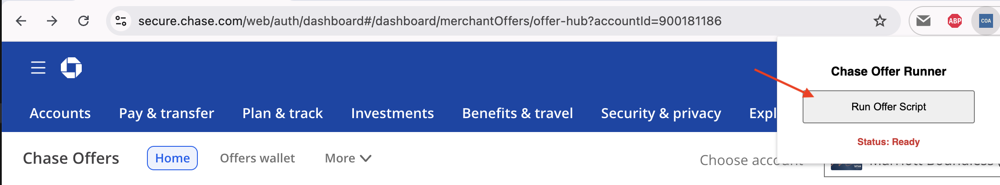
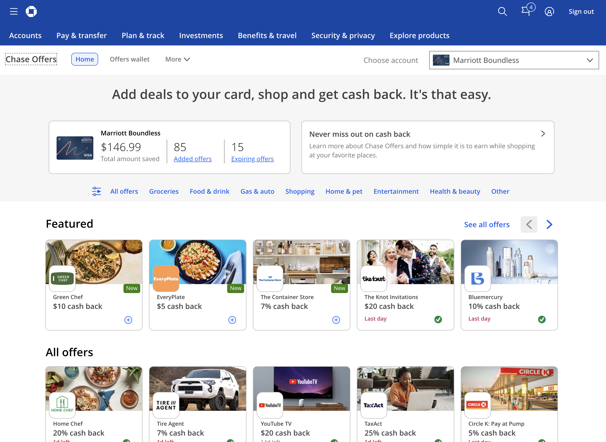

# Chase Offer Adder

> **Automate Chase Offers with ease!** Stop clicking endlessly and save time by automatically adding Chase Offers across all your credit cards.

[](https://opensource.org/licenses/MIT)
[]()

## 🚀 Quick Start

1. **Install** the extension (see [Installation](#installation) below)
2. **Navigate** to your Chase Offers page
3. **Click** the extension icon and hit "Add offers"
4. **Sit back** and watch it work automatically!

## 📋 Table of Contents

- [Overview](#overview)
- [Features](#features)
- [Installation](#installation)
- [How to Use](#how-to-use)
- [Screenshots](#screenshots)
- [Troubleshooting](#troubleshooting)
- [FAQ](#faq)
- [Disclaimer](#disclaimer)
- [For Developers](#for-developers)

## 📖 Overview

This Chrome extension automates the tedious process of adding Chase Offers to your credit cards. Instead of manually clicking through each offer and account, the extension:

- **Automatically detects** and clicks "Add to Card" buttons
- **Switches between accounts** seamlessly 
- **Provides real-time feedback** on progress
- **Pause/resume functionality** for complete control
- **Smart retry mechanism** to handle page loading delays
- **Handles errors gracefully** with clear status messages

### How It Works

1. 🔍 **Scans** the page for available "Add to Card" buttons
2. 🖱️ **Clicks** each button automatically with retry logic
3. 🔄 **Switches accounts** when current account is complete
4. 📊 **Updates status** in real-time
5. ⏸️ **Pause/resume** controls for full user control

## ✨ Features

- **🎯 Smart Button Detection**: Automatically finds and clicks "Add to Card" buttons
- **🔄 Multi-Account Support**: Processes offers across all your credit card accounts
- **⏸️ Pause/Resume Controls**: Stop and continue the process at any time
- **🔁 Retry Logic**: Handles page loading delays with 3-retry mechanism
- **📊 Real-time Status**: Live updates on progress and account switching
- **🛡️ Error Handling**: Graceful handling of various scenarios
- **🧭 Smart Navigation**: Efficient browser navigation between offers

## 📋 Prerequisites

- ✅ **Google Chrome** browser (version 88 or higher)
- ✅ **Chase Online Banking** account with active credit cards
- ✅ **Available Chase Offers** on your accounts

## 🔧 Installation

1. **📥 Download the Extension**
   ```bash
   git clone https://github.com/yourusername/chase-offer-adder.git
   ```

2. **🌐 Open Chrome Extensions**
   - Navigate to `chrome://extensions/`
   - Enable "Developer mode" (top-right toggle)

3. **📁 Load the Extension**
   - Click "Load unpacked"
   - Select the `chase-offer-adder` folder
   - The extension icon will appear in your toolbar



## 🎯 How to Use

1. **Navigate to Chase Offers**
   - Log into your Chase Online Banking
   - Go to your available offers page

2. **Start the Automation**
   - Click the extension icon in your toolbar
   - Click "Add offers" in the popup
   - The automation begins immediately

3. **Monitor Progress**
   - Watch real-time status updates
   - Use Pause/Resume as needed
   - Extension handles account switching automatically

### Controls

- **Add offers**: Start the automation
- **Pause**: Temporarily stop the process
- **Resume**: Continue from where you left off


## 🔧 Troubleshooting

**Extension not working:**
- Ensure you're on a Chase Offers page
- Refresh the page and try again
- Check that the extension is enabled

**No buttons found:**
- Confirm you're on the correct offers page
- Verify you have available offers
- Make sure you're logged into Chase

**Process stops:**
- Use Pause/Resume to restart
- Check your internet connection
- Refresh and restart if needed

**Tips for best results:**
- Keep the popup open while running
- Don't interact with the page during automation
- Use a stable internet connection

## ❓ FAQ

**Q: Is this safe to use?**
A: Yes, the extension only interacts with Chase's website and doesn't collect personal information.

**Q: Does this work with multiple accounts?**
A: Yes, it automatically detects and processes all your credit card accounts.

**Q: What if Chase updates their website?**
A: The extension may need updates if Chase changes their structure. Check for updates regularly.

**Q: Does this work on mobile?**
A: No, this is a Chrome desktop extension only.

**Q: What if it gets stuck?**
A: Use the Pause button, refresh the page, and restart.


## 📸 Screenshots

### Extension Interface


### Chase Offers Page Example


## ⚖️ Disclaimer

- This extension is provided "as-is" without warranty
- Not affiliated with JPMorgan Chase & Co.
- Use responsibly and in moderation
- Chase website changes may break functionality
- Your responsibility to comply with Chase's terms of service

## For Developers

Interested in the technical details, development setup, or contributing? Check out our [Technical Documentation](TECHNICAL.md) for:

- Architecture and code structure
- Development commands and testing
- Chrome extension implementation details
- Contributing guidelines

## 📄 License

MIT License - see [LICENSE](LICENSE) file for details.

---

**Version:** 1.0.0  
**Last Updated:** August 2025
