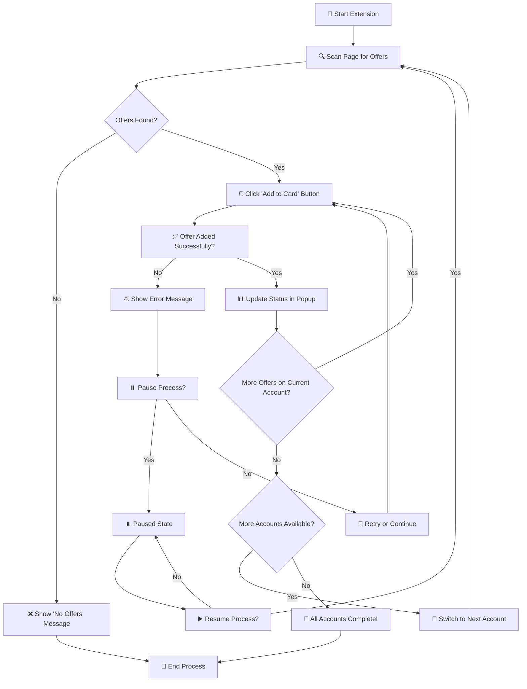

# Chase Offer Adder - Chrome Extension

> **Automate Chase Offers with ease!** Stop clicking endlessly and save time by automatically adding Chase Offers across all your credit cards.

[](https://chrome.google.com/webstore)
[](https://opensource.org/licenses/MIT)
[]()

## 🚀 Quick Start

1. **Install** the extension (see [Installation](#installation) below)
2. **Navigate** to your Chase Offers page
3. **Click** the extension icon and hit "Add offers"
4. **Sit back** and watch it work automatically!

## 📋 Table of Contents

- [Overview](#overview)
- [Features](#features)
- [Prerequisites](#prerequisites)
- [Installation](#installation)
- [How to Use](#how-to-use)
- [Status Messages](#status-messages)
- [Troubleshooting](#troubleshooting)
- [FAQ](#faq)
- [Limitations](#limitations)
- [Screenshots](#screenshots)
- [Disclaimer](#disclaimer)
- [License](#license)

## 📖 Overview

This Chrome extension automates the tedious process of adding Chase Offers to your credit cards. Instead of manually clicking through each offer and account, the extension:

- **Automatically detects** and clicks "Add to Card" buttons
- **Switches between accounts** seamlessly
- **Provides real-time feedback** on progress
- **Allows pause/resume** functionality for control
- **Handles errors gracefully** with clear status messages

### How It Works

When you're on a Chase page displaying offers, the extension injects a script that:

1. 🔍 **Scans** the page for available "Add to Card" buttons
2. 🖱️ **Clicks** each button automatically
3. 🔄 **Switches accounts** when current account is complete
4. 📊 **Updates status** in real-time
5. ⏸️ **Allows interruption** with pause/resume controls

## ✨ Features

### 🎯 Core Functionality

- **Smart Button Detection**: Automatically finds and clicks "Add to Card" buttons
- **Multi-Account Support**: Processes offers across all your credit card accounts
- **Real-time Status Updates**: Clear feedback about current operations
- **Error Handling**: Graceful handling of various scenarios and edge cases

### 🎮 User Controls

- **One-Click Start**: Simple "Add offers" button to begin automation
- **Pause/Resume**: Stop and continue the process at any time
- **Status Monitoring**: Live updates on progress and account switching
- **Clean Interface**: Minimal, intuitive popup design

### 🔄 Advanced Features

- **Automatic Account Switching**: Seamlessly moves between credit card accounts
- **Sequential Processing**: Handles offers systematically for each account
- **Session Persistence**: Remembers state during pause/resume cycles
- **Smart Navigation**: Uses browser back button efficiently between offers

## 📋 Prerequisites

Before installing this extension, ensure you have:

- ✅ **Google Chrome** browser (version 88 or higher)
- ✅ **Chase Online Banking** account with active credit cards
- ✅ **Available Chase Offers** on your accounts
- ✅ **Developer Mode** enabled in Chrome (for manual installation)

## 🔧 Installation

Since this extension is not available on the Chrome Web Store, you'll need to install it manually:

### Step-by-Step Installation

1. **📥 Download the Extension**

   ```bash
   git clone https://github.com/yourusername/chase-offer-adder.git
   # OR download and extract the ZIP file
   ```

2. **🌐 Open Chrome Extensions**
   - Open Google Chrome
   - Navigate to `chrome://extensions/`
   - Or go to Menu → More Tools → Extensions

3. **🔧 Enable Developer Mode**
   - Toggle the "Developer mode" switch in the top-right corner
   - This enables the "Load unpacked" option

4. **📁 Load the Extension**
   - Click "Load unpacked" button
   - Select the folder containing `manifest.json`
   - The extension should appear in your extensions list

5. **✅ Verify Installation**
   - Look for the "Chase Offer Adder" icon in your Chrome toolbar
   - Click the icon to open the popup interface


### File Structure

Ensure your extension folder contains:

```
chase-offer-adder/
├── manifest.json
├── popup.html
├── popup.js
└── images/
    ├── icon128.png
    ├── popup.png
    └── offer_page_example.png
```

## 🎯 How to Use

### Basic Usage

1. **Navigate to Chase Offers**
   - Log into your Chase Online Banking
   - Go to the page displaying your available offers
   - Ensure you're on the correct offers page

2. **Start the Automation**
   - Click the extension icon in your Chrome toolbar
   - Click the "Add offers" button in the popup
   - The script will begin processing automatically

3. **Monitor Progress**
   - Watch the status updates in the popup
   - Use the Pause/Resume button as needed
   - Wait for completion notification

### Detailed Process Flow



**What happens during execution:**

- 🔍 **Scanning**: Extension searches for "Add to Card" buttons
- 🖱️ **Clicking**: Automatically clicks each button found
- 🔄 **Switching**: Moves to next account when current is complete
- 📊 **Updating**: Shows real-time status in popup
- ✅ **Completing**: Finishes when all accounts are processed

### Controls

| Button | Action | When Available |
|--------|--------|----------------|
| **Add offers** | Starts the automation process | Always (when on Chase page) |
| **Pause** | Temporarily stops the process | During active automation |
| **Resume** | Continues from where it left off | When process is paused |

## 📊 Status Messages

The extension provides clear feedback through various status messages:

### Active Status Messages

- `"Status: Adding offers..."` - Script is actively processing offers
- `"Status: Paused"` - Process is temporarily stopped
- `"Switched to account: [Account Name]"` - Successfully changed to a new account
- `"All accounts processed"` - Script has completed all accounts

### Error Messages

- `"No 'Add to Card' buttons found"` - No offers available on current page
- `"Error: [specific error]"` - Technical issues encountered
- `"Please navigate to Chase Offers page"` - Wrong page detected

### Success Messages

- `"Offer added successfully"` - Individual offer processed
- `"Account [Name] completed"` - All offers added for current account
- `"Process completed successfully"` - All accounts processed

## 🔧 Troubleshooting

### Common Issues

**Extension not working:**

- ✅ Ensure you're on a Chase Offers page
- ✅ Check that Developer Mode is enabled
- ✅ Verify the extension is loaded correctly
- ✅ Refresh the page and try again

**No buttons found:**

- ✅ Confirm you're on the correct Chase Offers page
- ✅ Check if you have available offers
- ✅ Try refreshing the page
- ✅ Ensure you're logged into Chase Online Banking

**Process stops unexpectedly:**

- ✅ Check your internet connection
- ✅ Verify Chase website is responding
- ✅ Use the Pause/Resume button to restart
- ✅ Refresh the page and restart the process

**Extension disappears:**

- ✅ Re-enable Developer Mode
- ✅ Re-load the extension using "Load unpacked"
- ✅ Check if Chrome was updated recently

### Performance Tips

- 🚀 **Close unnecessary tabs** to improve performance
- 🚀 **Use a stable internet connection** for reliable operation
- 🚀 **Don't interact with the page** while the script is running
- 🚀 **Keep the popup open** to monitor progress

## ❓ FAQ

**Q: Is this extension safe to use?**
A: Yes, the extension only interacts with Chase's website and doesn't collect or store any personal information.

**Q: Will this violate Chase's terms of service?**
A: The extension automates manual clicking, which is generally acceptable. However, use responsibly and avoid excessive automation.

**Q: What if Chase updates their website?**
A: The extension may need updates if Chase changes their website structure. Check for updates regularly.

**Q: Can I use this on multiple Chase accounts?**
A: Yes, the extension automatically detects and processes all your credit card accounts.

**Q: Does this work on mobile?**
A: No, this is a Chrome desktop extension only.

**Q: What if the process gets stuck?**
A: Use the Pause button, refresh the page, and restart the process.

## ⚠️ Limitations

### Technical Limitations

- **Browser Dependency**: Only works in Google Chrome
- **Single Tab Operation**: Must run on the active tab
- **Manual Navigation**: Requires manual navigation to Chase Offers page
- **Website Changes**: May break if Chase updates their website structure

### Usage Limitations

- **Initial Setup**: Requires manual installation (not on Chrome Web Store)
- **Page Requirements**: Must be on specific Chase Offers page
- **Account Access**: Requires active Chase Online Banking login
- **Offer Availability**: Only works when offers are available

### Performance Considerations

- **Internet Speed**: Requires stable internet connection
- **Browser Performance**: May be affected by other browser activity
- **Website Load Times**: Dependent on Chase website responsiveness

## 📸 Screenshots

### Extension Interface

The clean, intuitive popup interface with all controls easily accessible.


### Chase Offers Page

Example of the type of page and "Add to Card" buttons the extension interacts with.


## ⚖️ Disclaimer

**Important Legal Information:**

- This extension is provided **"as-is"** without any warranty
- **Not affiliated** with, endorsed by, or sponsored by JPMorgan Chase & Co.
- **Website changes** may break functionality without notice
- **Use responsibly** and avoid excessive automation
- **Compliance** with Chase's terms of service is your responsibility
- **No guarantee** of continued functionality or compatibility

**Recommendations:**

- Monitor the extension's performance regularly
- Report issues through the project's GitHub repository
- Keep the extension updated when new versions are available
- Use in moderation to avoid overwhelming Chase's servers

## 📄 License

This project is licensed under the **MIT License** - see the [LICENSE](LICENSE) file for details.

The MIT License allows you to:

- ✅ Use the software for any purpose
- ✅ Modify the software
- ✅ Distribute the software
- ✅ Use it commercially
- ✅ Use it privately

## 🤝 Contributing

Contributions are welcome! Please feel free to submit a Pull Request.

## 📞 Support

If you encounter issues or have questions:

1. **Check the FAQ** section above
2. **Review troubleshooting** steps
3. **Open an issue** on GitHub
4. **Check for updates** to the extension

---

**Last Updated:** May 10, 2025
**Version:** 1.0.0
**Chrome Version:** 88+
